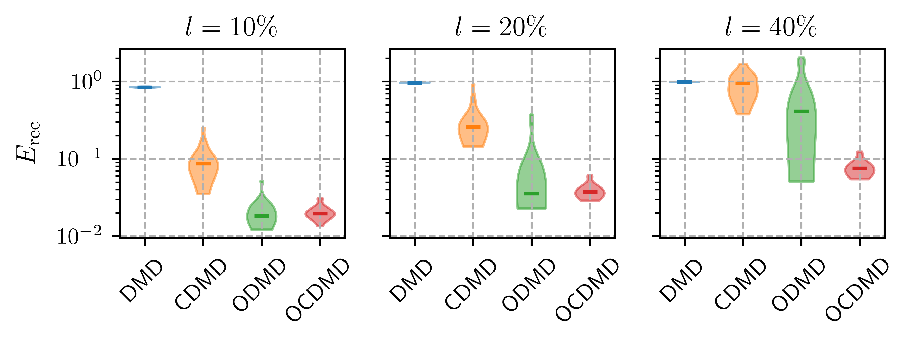

# An optimized DMD to identify linear dynamics in noisy flow data

This code repository accompanies the article [An optimized DMD to identify linear dynamics in noisy flow data](link_to_be_added).
The research is part of the research unit [FOR 2895](https://www.for2895.uni-stuttgart.de/en/) on
*Unsteady flow and interaction phenomena at High Speed Stall conditions*.

We introduce a new
variant of dynamic mode decomposition (DMD) that simultaneously identifies
linear dynamic and noise in corrupted snapshots of flow data. Moreover, multiple concepts like forward-backward-consistency (*consistent DMD*), error propagation
(*optimized DMD*), and train-test-splitting are combined to improve the robustness of the operator identification.
The optimization relies on automatic differentiation and gradient descent.

## Results

Noise is added to snapshots of the flow past a cylinder at signal-to-noise ratios of *l*.
20 different trials with randomly sampled noise are performed for each variant and noise level.
The benchmarked DMD variants are:

- **DMD:** vanilla (projected) DMD
- **CDMD:** consistent DMD ([reference](https://epubs.siam.org/doi/10.1137/18M1233960))
- **ODMD:** optimized DMD ([reference](https://epubs.siam.org/doi/10.1137/M1124176)) 
- **OCDMD:** the DMD variant introduced here

The figure below shows the distribution of the reconstruction accuracy. The horizontal bar in each violin plot
marks the median reconstruction error. Our approach has the smallest spread across all
noise levels and outperforms all other approaches for the highest noise level.
For more details, refer to the article linked above.



## Reproducibility

The notebook [cylinder.ipynb](./cylinder.ipynb) contains the Python
code for benchmarking, analysis, and visualization. The new DMD variant
is available on the development branch of [flowTorch](https://github.com/FlowModelingControl/flowtorch), which can be
installed via *pip*:
```
pip3 install git+https://github.com/FlowModelingControl/flowtorch.git@aweiner
```
To get access to the snapshot data, please contact us via mail.

## Acknowledgement

We gratefully acknowledge the Deutsche Forschungsgemeinschaft DFG (German Research Foundation) for funding this work in the framework of the research unit FOR 2895 under the grant WE 6948/1-1.